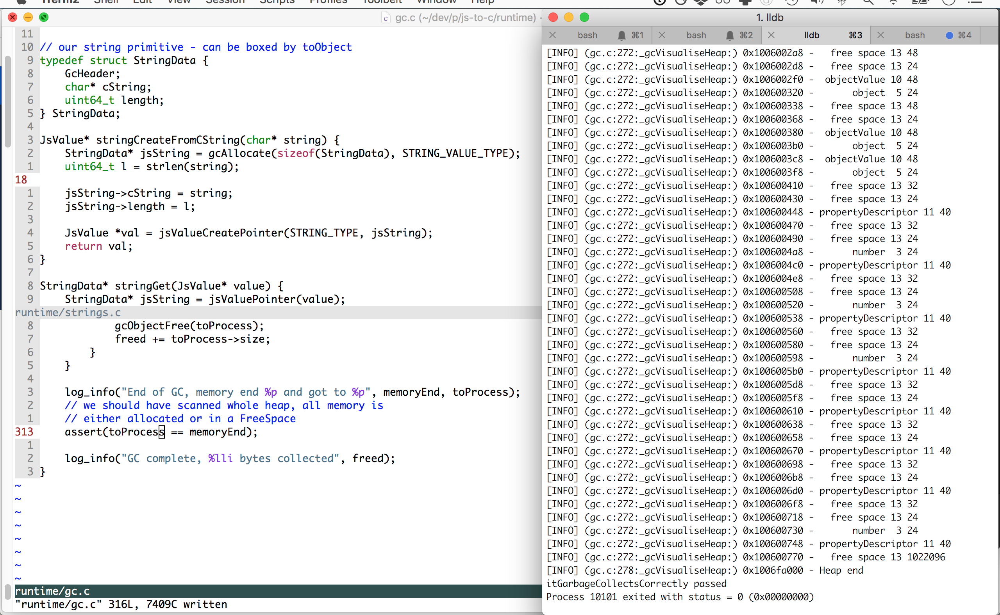

# Notes

## 26 Jan 2019

Even with `gcStartProtectAllocations()` still seeing a crash after 90 iterations, when log is being called:

```
[INFO] (/Users/timruffles/dev/p/js-to-c/runtime/environments.c:49:envGet) Looked up console in 0x7f8fb4801a28 got type object
[INFO] (/Users/timruffles/dev/p/js-to-c/runtime/objects.c:100:objectGet) Getting log
[INFO] (/Users/timruffles/dev/p/js-to-c/runtime/environments.c:49:envGet) Looked up i in 0x7f8fb4801a28 got type number
[INFO] (/Users/timruffles/dev/p/js-to-c/runtime/functions.c:30:functionRunWithArguments) Getting fn record
[INFO] (/Users/timruffles/dev/p/js-to-c/runtime/functions.c:32:functionRunWithArguments) Fn record 0x7f8fb4801aa8
[INFO] (/Users/timruffles/dev/p/js-to-c/runtime/environments.c:32:envCreateForCall) Created call env 0x7f8fb4805f08 parent 0x7f8fb4801a28, now looping over 1 args
[INFO] (/Users/timruffles/dev/p/js-to-c/runtime/environments.c:34:envCreateForCall) Env name arg0
[INFO] (/Users/timruffles/dev/p/js-to-c/runtime/objects.c:194:objectSet) Setting arg0 in object at 0x7f8fb4805f08
[INFO] (/Users/timruffles/dev/p/js-to-c/runtime/objects.c:200:objectSet) looking in 0x0 for props
global-garbage(5075,0x7fff9a0e1340) malloc: *** error for object 0x7f8fb4408750: pointer being freed was not allocated
*** set a breakpoint in malloc_error_break to debug
```

This is the problem the atomic groups were designed to solve!

Looking at the atomic group design the nesting behaviour we need to ensure is while a parent group is open, closing a child doesn't close the larger open group.

Cleaning up group state is interesting. Doing a linear scan of the heap at the end isn't ideal as it happens every function call. We could store a group id and clear/ignore it if we're not in a group or it's below current highest group id (looping it for max generations). Tracking the nesting would give us an idea of how many groups to close out.

## 15 Jan 2019

```
# right after userProgram(...) {, we already have string declared
[INFO] (/Users/timruffles/p/js-to-c/runtime/gc.c:295:_gcVisualiseHeap) 0x100801358 -       string  6 24
...
[INFO] (/Users/timruffles/p/js-to-c/runtime/gc.c:271:gcObjectFree) freeing string data 'console' at 0x100801338
[INFO] (/Users/timruffles/p/js-to-c/runtime/gc.c:330:_gcRun) scanned to 0x100801358
[INFO] (/Users/timruffles/p/js-to-c/runtime/gc.c:273:gcObjectFree) freeing string '' at 0x100801358
[INFO] (/Users/timruffles/p/js-to-c/runtime/gc.c:330:_gcRun) scanned to 0x100801370
...
[ERROR] (/Users/timruffles/p/js-to-c/runtime/language.c:122:jsValuePointer) Expected pointer value, got free space at 0x100801358
```
- ah - we create console, log etc in`global.c`, now they're being GC'd?
- Seem to have a second set of strings, for stuff that's interned, e.g 'console'
- right, it's the interned strings being GC'd, whoops
  - `console` is GC'd because it's not pointed at. The global `console`
    is pointed to but not interned stuff
- attempting to add idea of protected allocation to GC
  - also create runtime before gcInit, so it truly is the one place we store global state


## 13 Jan 2019


### Still issue

Still can't access this post GC, wonder what's up

```
[INFO] (gc.test.c:158:itCanReuseMemory) value type:objectValue address:0x1005005e8
[INFO] (objects.c:102:objectGet) Getting liveOne
[ERROR] (language.c:120:jsValuePointer) Expected pointer value, got objectValue at 0x1005005e8
```

### Weirder

Root object is outside the heap?!

```
[INFO] (gc.c:301:_gcRun) GC starting on 1 roots
[INFO] (gc.c:307:_gcRun) marking root object at 0x100302458 0
[INFO] (gc.c:243:traverse) traverse object 0x100302458
```

vs

```
[INFO] (gc.c:280:_gcVisualiseHeap) 0x100302750 - Heap start
[INFO] (gc.c:290:_gcVisualiseHeap) 0x100302750 -  objectValue 10 40
[INFO] (gc.c:290:_gcVisualiseHeap) 0x100302778 -       object  5 24
[INFO] (gc.c:290:_gcVisualiseHeap) 0x100302790 -  objectValue 10 40
```

oh... we double init the heap

```
[INFO] (gc.c:125:gcInit) initialised gc with heap size 800
[INFO] (runtime.c:54:runtimeInit) setup gc
[INFO] (objects.c:196:objectSet) Setting console in object at 0x100302458
[INFO] (objects.c:202:objectSet) looking in 0x0 for props
[INFO] (global.c:64:createGlobalObject) log fn 0x1003025e8 env 0x100302458
[INFO] (objects.c:196:objectSet) Setting log in object at 0x100302498
[INFO] (objects.c:202:objectSet) looking in 0x0 for props
[INFO] (objects.c:196:objectSet) Setting global in object at 0x100302458
[INFO] (objects.c:202:objectSet) looking in 0x1003024e8 for props
[INFO] (runtime.c:58:runtimeInit) created runtime environment
[INFO] (gc.c:125:gcInit) initialised gc with heap size 800
```

### Weird

GC bug, where stuff is being GC'd incorrectly. After GC looks healthy, we're
left with the root obj and live object linked to it:
```
[INFO] (gc.c:279:_gcVisualiseHeap) 0x100500610 - Heap start
[INFO] (gc.c:289:_gcVisualiseHeap) 0x100500610 -   free space 13 40
[INFO] (gc.c:289:_gcVisualiseHeap) 0x100500638 -   free space 13 24
[INFO] (gc.c:289:_gcVisualiseHeap) 0x100500650 -   free space 13 40
[INFO] (gc.c:289:_gcVisualiseHeap) 0x100500678 -   free space 13 24
[INFO] (gc.c:289:_gcVisualiseHeap) 0x100500690 -   free space 13 40
[INFO] (gc.c:289:_gcVisualiseHeap) 0x1005006b8 -   free space 13 24
[INFO] (gc.c:289:_gcVisualiseHeap) 0x1005006d0 -   free space 13 40
[INFO] (gc.c:289:_gcVisualiseHeap) 0x1005006f8 -   free space 13 24
[INFO] (gc.c:289:_gcVisualiseHeap) 0x100500710 -   free space 13 40
[INFO] (gc.c:289:_gcVisualiseHeap) 0x100500738 -   free space 13 24
[INFO] (gc.c:289:_gcVisualiseHeap) 0x100500750 -   free space 13 40
[INFO] (gc.c:289:_gcVisualiseHeap) 0x100500778 -   free space 13 24
[INFO] (gc.c:289:_gcVisualiseHeap) 0x100500790 -   free space 13 40
[INFO] (gc.c:289:_gcVisualiseHeap) 0x1005007b8 -   free space 13 24
[INFO] (gc.c:289:_gcVisualiseHeap) 0x1005007d0 -   free space 13 40
[INFO] (gc.c:289:_gcVisualiseHeap) 0x1005007f8 -   free space 13 24
[INFO] (gc.c:289:_gcVisualiseHeap) 0x100500810 -  objectValue 10 40
[INFO] (gc.c:289:_gcVisualiseHeap) 0x100500838 -       object  5 24
[INFO] (gc.c:289:_gcVisualiseHeap) 0x100500850 -  objectValue 10 40
[INFO] (gc.c:289:_gcVisualiseHeap) 0x100500878 -       object  5 24
[INFO] (gc.c:289:_gcVisualiseHeap) 0x100500890 -  stringValue  9 32
[INFO] (gc.c:289:_gcVisualiseHeap) 0x1005008b0 -       string  6 24
[INFO] (gc.c:289:_gcVisualiseHeap) 0x1005008c8 - propertyDescriptor 11 40
[INFO] (gc.c:289:_gcVisualiseHeap) 0x1005008f0 -   free space 13 64
```

then we wipe it all out :(

```
[INFO] (gc.c:279:_gcVisualiseHeap) 0x100302750 - Heap start
[INFO] (gc.c:289:_gcVisualiseHeap) 0x100302750 -   free space 13 40
[INFO] (gc.c:289:_gcVisualiseHeap) 0x100302778 -   free space 13 24
[INFO] (gc.c:289:_gcVisualiseHeap) 0x100302790 -   free space 13 40
[INFO] (gc.c:289:_gcVisualiseHeap) 0x1003027b8 -   free space 13 24
[INFO] (gc.c:289:_gcVisualiseHeap) 0x1003027d0 -   free space 13 40
[INFO] (gc.c:289:_gcVisualiseHeap) 0x1003027f8 -   free space 13 24
[INFO] (gc.c:289:_gcVisualiseHeap) 0x100302810 -   free space 13 40
[INFO] (gc.c:289:_gcVisualiseHeap) 0x100302838 -   free space 13 24
[INFO] (gc.c:289:_gcVisualiseHeap) 0x100302850 -   free space 13 40
[INFO] (gc.c:289:_gcVisualiseHeap) 0x100302878 -   free space 13 24
[INFO] (gc.c:289:_gcVisualiseHeap) 0x100302890 -   free space 13 40
[INFO] (gc.c:289:_gcVisualiseHeap) 0x1003028b8 -   free space 13 24
[INFO] (gc.c:289:_gcVisualiseHeap) 0x1003028d0 -   free space 13 40
[INFO] (gc.c:289:_gcVisualiseHeap) 0x1003028f8 -   free space 13 24
[INFO] (gc.c:289:_gcVisualiseHeap) 0x100302910 -   free space 13 40
[INFO] (gc.c:289:_gcVisualiseHeap) 0x100302938 -   free space 13 24
[INFO] (gc.c:289:_gcVisualiseHeap) 0x100302950 -   free space 13 40
[INFO] (gc.c:289:_gcVisualiseHeap) 0x100302978 -   free space 13 24
[INFO] (gc.c:289:_gcVisualiseHeap) 0x100302990 -   free space 13 40
[INFO] (gc.c:289:_gcVisualiseHeap) 0x1003029b8 -   free space 13 24
[INFO] (gc.c:289:_gcVisualiseHeap) 0x1003029d0 -   free space 13 32
[INFO] (gc.c:289:_gcVisualiseHeap) 0x1003029f0 -   free space 13 24
[INFO] (gc.c:289:_gcVisualiseHeap) 0x100302a08 -   free space 13 40
[INFO] (gc.c:289:_gcVisualiseHeap) 0x100302a30 -  objectValue 10 40
[INFO] (gc.c:289:_gcVisualiseHeap) 0x100302a58 -       object  5 24
```

wait it's just a bad test, what a silly. We need to pass roots to GC via runtime. Duh.

## 12 December 2018

Hit an test failure that ended in extended the GC. A GC test designed to force some GC runs was crashing:

```
while(i < 1000) {
  obj = {prop: i}; 
  i = i + 1;
  console.log(i)
}
```

Afer a session or two of debugging, I realised the call env for the `console.log` call was being freed before the call was complete, and that this was likely not the only example of the root problem. That problem being that there were atomic operations in the runtime which involve multiple allocations that can trigger GC. If the parts of the operation allocated before the GC run were not protected, then bad things ensued.

Pre-marking the allocated items would be a partial solution, which'd fail only if there were multiple GC runs during the allocation. Pretty unlikely, but it seemed safer to solve completely. I added the concept of atomic GC groups, which would be protected until the group was committed:

```
GcAtomicId gid = gcAtomicGroupStart();
// multiple allocations
gcAtomicGroupEnd(gid);
```

### Scattered notes

- got reuse working, but now having an issue with objects either
  being GC'd incorrectly or moved? This assertion is failing in two tests

```
assert(JS_GET(root, "liveOne") == liveOne);
```

- FIXED: seems like the free list isn't being pushed down, not reusing space
  - debuggin this is a pain... more tools?
- free list code is clearly rather borked...
- rewrote config system for simplicity, and wrote failing test
[INFO] (gc.c:232:gcAllocate) Allocated string at 0x101f00320
[ERROR] (language.c:202:jsValueReflect) Non JSValue free space
- mm, config system is kinda terrible
  - look online for a better one, would be nice to be
    able to init a subsystem for testing
- ah, looks like allocation in free zones is totally borked - all allocations hitting same area:

[INFO] (runtime/gc.c:233:gcAllocate) Allocated stringValue at 0x7fcbdf8037e0
[INFO] (runtime/gc.c:233:gcAllocate) Allocated string at 0x7fcbdf8037e0
[INFO] (runtime/objects.c:196:objectSet) Setting   in object at 0x7fcbdf8037a0
[INFO] (runtime/objects.c:202:objectSet) looking in 0x7fcbdf801678 for props
[INFO] (runtime/gc.c:233:gcAllocate) Allocated stringValue at 0x7fcbdf8037e0
[INFO] (runtime/gc.c:233:gcAllocate) Allocated string at 0x7fcbdf8037e0
[INFO] (runtime/environments.c:51:envGet) Looked up   in 0x7fcbdf8037a0 got type object
[INFO] (runtime/environments.c:51:envGet) Looked up i in 0x7fcbdf801028 got type number
[INFO] (runtime/gc.c:233:gcAllocate) Allocated number at 0x7fcbdf8037e0
[INFO] (runtime/gc.c:233:gcAllocate) Allocated objectValue at 0x7fcbdf801678
[INFO] (runtime/gc.c:233:gcAllocate) Allocated object at 0x7fcbdf8037e0
[INFO] (runtime/environments.c:51:envGet) Looked up i in 0x7fcbdf801028 got type number
[INFO] (runtime/objects.c:196:objectSet) Setting hiThere in object at 0x7fcbdf8037e0
[INFO] (runtime/objects.c:202:objectSet) looking in 0x7fcbdf8037e0 for props
[ERROR] (runtime/language.c:120:jsValuePointer) Expected pointer value, got objectValue at 0x7fcbdf801678
  
- odd, we have `objectVal->object->properties == objectVal!`
- mm, now it seems like we're allocating over objs still referenced...
  - 
  - `[ERROR] (/Users/timruffles/dev/p/js-to-c/runtime/language.c:120:jsValuePointer) Expected pointer value, got objectValue at 0x7fd243001678`
- added working atomic operator and passing `itCanPreventGcInTheMiddleOfAGroupOfOperations`, now need to wrap some ops with it
- okay, nasty thing
  - many operations in the compiler that are atomic
    from the POV of GC (creating a call env) can trigger GC,
    so we'll need to mark this as a 'in progress' operation, and
    keep these objects in a GC buffer to avoid freeing half of them
- ahh - are we freeing the call env!
- not freeing anything before bug runs
- console.log fn env is NULL


```
int id = gcAtomicAllocationGroupEnter()
...
gcAtomicAllocationGroupExit(id)
```


## 23 September 2018

## Prelude

I realised it'd be very useful to have a prelude - implementing bits of the system in JS, once enough of the language has been bootstrapped. e.g various flavours of errors would be boring to implement in C, but easy enough in JS.

This led me to think about a dynamic library approach, ending up with a runtime.dylib. That'd be included by the target programs.

## GC

Another tricky issue where GC occurs while intermediary steps are being carried out:

    // hello = {something: i};
    JsValue *objectLiteral_9 = objectCreatePlain();
    JsValue *value_10 = (envGet(env, interned_1 /* i */));
    objectSet(objectLiteral_9, interned_11, value_10);
    result_8 = (objectLiteral_9);
    // if GC occured between the object literal creation and here, we could
    // be setting env to an empty object
    envSet(env, interned_3, result_8);

the root is this:

1. make GC able thing
2. other steps that may trigger a GC
3. link object to GC root

Time to consider how to fix this. First thing that jumps to mind is having the compiler mark values that are being used in an intermediary process, e.g

    JsValue *objectLiteral_9 = INTERMEDIATE(objectCreatePlain());
    // other stuff 
    FINISH(objectLiteral_9);

Where `INTERMEDIATE(...)` sets a flag and `FINISH(...)` clears it.

Is there a way to avoid this? GC only knows to walk routes - the intermediary values in the compiled code are invisible to it.

## 12 September 2018

It's very convenient that C and JS semantics are similar - implementing `break`/`continue` was as simple as reusing C's own break/continues, and slightly reworking `for ... in` loops so the keywords would have the desired effect.

## 8 September 2018

Looking at the top-level node types in ESTree, ES5 had 41, since ES6 there another 26 have appeared, a growth of 61%.

- ES5
  - ArrayExpression
  - AssignmentExpression
  - BinaryExpression
  - BlockStatement
  - BreakStatement
  - CallExpression
  - CatchClause
  - ConditionalExpression
  - ContinueStatement
  - DebuggerStatement
  - DoWhileStatement
  - EmptyStatement
  - ExpressionStatement
  - ForInStatement
  - ForStatement
  - FunctionDeclaration
  - FunctionExpression
  - Identifier
  - IfStatement
  - LabeledStatement
  - Literal
  - LogicalExpression
  - MemberExpression
  - MethodDefinition
  - NewExpression
  - ObjectExpression
  - Program
  - Property
  - ReturnStatement
  - SequenceExpression
  - SwitchCase
  - SwitchStatement
  - ThisExpression
  - ThrowStatement
  - TryStatement
  - UnaryExpression
  - UpdateExpression
  - VariableDeclaration
  - VariableDeclarator
  - WhileStatement
  - WithStatement

- ES2015+
  - ArrayPattern
  - ArrowFunctionExpression
  - AssignmentPattern
  - AwaitExpression
  - ClassBody
  - ClassDeclaration
  - ClassExpression
  - ExportAllDeclaration
  - ExportDefaultDeclaration
  - ExportNamedDeclaration
  - ExportSpecifier
  - ForOfStatement
  - Import
  - ImportDeclaration
  - ImportDefaultSpecifier
  - ImportNamespaceSpecifier
  - ImportSpecifier
  - MetaProperty
  - ObjectPattern
  - RestElement
  - SpreadElement
  - Super
  - TaggedTemplateExpression
  - TemplateElement
  - TemplateLiteral
  - YieldExpression

## 6 September 2018

A lot of the standard library is likely best implemented in JS - so it'd be good to setup the ability to compile a prelude. That could be precompiled and linked into the program.

## 5 September 2018

Read compiler warnings! Had 15 minutes of fun trying to work out why a pointer returning function was returning half a pointer. It was because I hadn't exposed its prototype in the header, so it was only returning an int's worth of space.

## 4 September 2018

A lot of operations can throw errors in JS! I was originally passing env to throw methods, but now I think I'll have to avoid doing so.

So many features are inter-related: for instance exceptions would make it nice to have dynamic strings for proper error messages. I've often felt like I'm implementing this by walking the dependency graph between various language features.

## 30 August 2018

### Async

Since exceptions etc are tied into the concept of task queues, should roughly sketch them to avoid coding myself into a corner.

- IO will schedule a callback
- Task queue will wait for resolved callbacks
- Each callback will kick off a new execution
- RuntimeEnvironment will need to be setup for this
- Then go back to task queue and wait

Exceptions etc will work in the queue as per usual.

Seems sensible to use libuv.

So effectively program becomes:

- run initial program
- start loop
-   run stuff
- out of loop - exit 0

The task queues are GC roots, walking the environment hierarchies of any callback scheduled.

    struct JsCallback {
      FunctionRecord* jsFunction;
    }

might need to think about varargs a bit too.

### Exceptions thinking

Example compilation:

    var a = 'start';
    try {
      a += ' try';
      if(Math.random() > 0.5) throw Error("A");
      a += ' after try';
    } catch(e) {
      a += ' in catch';
      console.log(e);
    }
    console.log('after catch', a);

could compile to something like:

    void userFunctionEg(Env* env) {
      // var a = 'start';
      exceptionStackPush()
      if(setjmp(exceptionsJmpBuf) == 0) {
          // a+ ' try';
          // if(Math.random() > 0.5)
          // throw Error("A");
          longjmp(expectionsJmpBuf, 1);
          // a += ' after try';
      } else {
        cleanupEnv(runtime->throwingEnv, catchingEnv);
        // exception caught
        goto catch1;
      }

    afterTryCatch1:
      exceptionStackPop();
      // console.log('after catch', a);

    // catche
    catch1:
      // a += ' in catch';
      // console.log(e);
      goto afterTryCatch1;
    }

with defintions

    void exceptionStackPush() {
      if(expectionsJmpBuf) {
          exceptionStackAppend();
      }
    }

    void exceptionStackPop() {
      if(exceptionStack == NULL) {
        fail("Popping exception stack when empty");
      }
      exceptionStack = exceptionStack->parent;
    }

macros:

    #define exceptionCatch(label)

## 29 August 2018

Exceptions:

- reified call-stacks
- some internal methods to throw different types of exceptions
- other things being thrown
- call-stack API + stringification
- catching
- scope for catch blocks
  - interestingly - same as ES6 block scope

Function call - likely modify current `envCreateForCall` to stack up the `FunctionRecord`. Just a linked list? Also - need to have a chain of exception handlers that switch on/off as calls return.


    function A() {
      try {
        catcher(noop)
      } catch(e) {
      }

      try {
        runner(boom)
      } catch(e) {
      } 

      try {
        unrelatedCatch(boom)
      } catch(e) {
      } 
    }

    function catcher(f) {
      try { f() } catch(e) {} 
    }

    function runner(f) { f() }

    function unrelatedCatch(f) {
      try { noop() } catch(e) {}
      f();
      try { noop() } catch(e) {}
    }

    function noop() {}
    function boom() {throw Error()}

## 23 August 2018

The non-moving GC cleans up the traversing code nicely.

I'm starting to fear large powers of 2, for they suggest I've screwed up, e.g: 

        [INFO] (gc.c:259:_gcVisualiseHeap:) 0x100600000 - Heap start
        [INFO] (gc.c:269:_gcVisualiseHeap:) 0x100600000 -  objectValue 48
        [INFO] (gc.c:269:_gcVisualiseHeap:) 0x100600030 -       object 24
        [INFO] (gc.c:269:_gcVisualiseHeap:) 0x100600048 -  objectValue 48
        [INFO] (gc.c:269:_gcVisualiseHeap:) 0x100600078 -       object 24
        [INFO] (gc.c:269:_gcVisualiseHeap:) 0x100600090 -     function 4294986170
        [INFO] (gc.c:273:_gcVisualiseHeap:) 0x200604a4a - ERROR - Unexpected scan end
        [INFO] (gc.c:275:_gcVisualiseHeap:) 0x1006fa000 - Heap end

After some fun, I tracked down this bug to stomping some memory by initiaising a struct directly:

        *jsString = (StringData) {
            .cString = string,
            .length = l,
        };

This forgets to reinitialize the `type` field from the `GcHeader` (also, StringData originally didn't have the `GcHeader` anyway). A tricky one - need to ponder whether there's a general rule here.

After fixing this:


I was left with a happy heap, with contiguous GC objects and FreeSpace nodes throughout:


    

## 21 August 2018

Ah... GC moves environments mid function execution! In the compiled code this is disasterous, e.g:

    JsValue* objectLiteral_9 = objectCreatePlain();
    // GC may have occured, moving `env` to a new poistion and invalidating 
    // the old env pointed to by env
    JsValue* value_10 = (envGet(env, interned_1) /* i */);

This will require some thought.

Options:
1. environments are special cased, and don't move
  - however, I think this is actually a more general problem
2. switch from a compacting GC
  - most work?
3. double pointers (where are they stored tho to be updated?)
  - some indirection seems necessary if keep with compacting GC, could be special cased for envs, perhaps `getEnv(id)`

Demonstration of 1 not really being a solution:

    JsValue* left_13 = (envGet(env, interned_1) /* i */);
    JsValue* right_14 = (jsValueCreateNumber(1));
    result_12 = (addOperator(left_13, right_14));

GC could easily occur between `left_13` being created and the `addOperator` being run, if the `jsValueCreateNumber` triggers a GC run.

Using the `movedTo` field could be somewhat of a solution, if the free call occured after the current call stack clears? Every reference to a JSValue would then be via `accessGcObject(someValue)`.

GC runs can't be deferred to the end of a user function as a solution to keeping all references live, as functions could trigger multiple GC runs (i.e a loop allocating).

It'd be nice to avoid the compiler being coupled to the GC system too much. Currently it's totally ignored the situation, so all pointers are irrevocably to the position a value is originally allocated.

Learning: end to end test early, I wrote unit tests with test code which carefully stopped using the old references, in a way that didn't resembled the compiler's output!

### Mark and sweep

Given a heap size of N, with a minimum GC object size M of the shared GC object header, we could track the memory with N/M bits.

## 20 August 2018

Thinking about GC - values like true/false/undefined were initially static, now they'll either need special-casing in the GC system (to keep the pointers constant), or not.

Special-casing isn't too tricky actually (which I realise after faffing around quite a lot to move them to be dynamically allocated), as they have defined types. Oops!

This could also point towards how to handle other special cases in GC.

It might also be nice to get more of the static stuff into runtime, thinking
about everything that is implicitly global etc and getting it in one place.

### Todo

- special case the language constants


## 13 August 2018

Comparison operators on pointers need care. `==` and `!=` seem always to be safe - everything else is pretty fraught. This came up while I was writing the GC step that walks up the heap of moved objects:


    GcObject* toProcess = (void*)nextHeap->bottom;
    while((char*)toProcess != nextHeap->top) {
        traverse(toProcess);
        toProcess = toProcess->next;
    }

Doing `while(toProcess < nextHeap->top)` triggered lots of compiler warnings. I think it would have been safe since both pointers were to an area of `malloc`'d memory, and I assume the addresses within have to be sequential. Pointers within the same array can certainly be compared with relational operators, and subtracted, without undefined behaviour.

## 8 August 2018

C makes decisions about where to abstract clearer - either pop structs in header, and write functions to conceal the structure, or not. Simple getters suggest perhaps exposing a read-only view of the struct, as this is equivalent to the getter anyhow (and refactoring is mechnical).

It becomes pretty clear that I'll need to tag the GC stored values, in a similar way to Lua, which uses a [CommonHeader macro](https://www.lua.org/source/5.3/lobject.h.html#CommonHeader) to give a rough 'polymorphism' via structure which reminds me of Go. I could let the tag do double duty and discriminate JsValues too.

## 7 August 2018

- GC - walk roots
- There is a root to every allocated object
  via a JsValue
- We walk JsValues and copy them over

I've realised we need some hetrogenous technique to track GC state for all non-immediate values, and that strings (and BigNums etc if in other languages) likely deserve separate handling. The initial design had JsValues mapping pretty closely to user-land JS values. What about more internal objects like PropertyDescriptor? Some, like FunctionRecord, should be exempt from GC, as they point to compiled code.

So case analysis:

- immediate data: currently just Number
- pointers:
  - strings
  - objects
  - environments (e.g activation records are in the heap, and refer to each other so will need to be part of GC)

Ruby's uses `uintptr_t` for all its allocated values, which are either immediate values or a pointer to an [RVALUE](https://github.com/ruby/ruby/blob/325d378a1f320c6225bfa1d1598be710ddf45159/gc.c#L410). This is a tagged pointer representation. 

Keeping the JsValue opaque, I can start off with a simple/inefficient representation and optimise later.

## 26 July 2018

Thinking about GC, the requirements are:

- need to know where next memory we can allocate is
  - which gets tricky after we've freed some, i.e we either need to remove or track gaps
- keep pointers valid after GC, so if an environment contains references to values they point to the same or equivalent values post GC
- identifying values to free, and allowing this algorithm to work over multiple GC runs

Thinking about GC, I thought one option was to `malloc` as usual and allow the OS to manage the space, with my job simply to track pointers to the values. The advantage could be that the alloc'd space is what is pointed to by the rest of the system. Since that's immutable, there's no need to update pointers in env etc.

However, the JsValue structs are specifically designed to be reasonably efficent, taking up only 2 pointers. Storing them on the heap, and then tracking them via pointers, is wasteful (i.e numbers now cost 24 bytes rather than 16).

    
    typedef struct JsObjectProperty {
        char* key;
        JsValue* value;
    } JsObjectProperty;

    JsValue* allocatedValues[];
    typedef JsValue** AllocatedValue;
    static JsValue** nextValue = allocatedValues;

    JsValue* allocateValue() {
        JsValue* value = calloc(1, sizeof(JsValue));
        *(nextValue) = value;
        nextValue += 1;
        return value; 
    }
    
The other challenge is, how would we do GC? We'd be iterating over `JsValue*` pointers but we'd need to identify `allocatedValues`. I abandoned this approach as I don't think the `alloc` solves anything, and the other approach seemed clearer.

The other approach was to allocate managed ranges of memory in which the `JsValue` structs would be allocated. The marks could be tracked internally or externally (a boolean `Marked` array of the same size that could be zeroed before GC) - internally seems easiest for now, and can be changed later.

So in this model all JsValues live in an array that's managed. During GC we look at the marked and moved properties and compact all live values to the bottom of the heap, counting how many values we have. Then we reset the managed heap pointer to the top, ready to overwrite the garbage. Pointers in environments and objects need to be updated as we go.

    typedef struct {
        // this will be updated to point to new location
        JsValue *value;

        // ...
    } ObjectPropertyDescriptor;

## 13 July 2018

Deciding on setjmp vs explicit handling has been going round back of my mind. Exceptions can be thrown by just about any code in JS, e.g the full horror of getters is clear here:

      b = 'yo';
      window.c = 'hi';
      
      var a = {
          get foo() {
              console.log("muahah");
              delete window.b;
              delete window.c;
          }
      }

      // throw - b is not defined
      console.log(a.foo, b, c);

I've roughly manually compiled the result of the two techniques below when compiling the following:

    try {
      console.log(a.foo, b());
    } catch(e) {
      console.log(typeof b);  
    }


### Setjmp

Primitives etc would use longjmp

    JsValue* objectGet(JsValue* val, ...) {
      if(isNullOrUndefined(val)) {
        // longjmp()
        throw(...)
      }
    }

So our compiled code would setup setjmp's at catches:

    userProgram() {
      // try, via setjmp - setjmp returns 0 when not returning from
      // a jmp
      if(!setjmp()) {
        // code for envGet(env, 'a')
        // code for objectGet(a, 'foo')
        // code for call to b()
        // code for envGet(env, 'console'), for the log
      } else {
        // < stack unwinding code >
        // create new env with 'e' bound to error
        // code for console.log etc
      }
    }

GC is interesting, for expressions that don't assign vars
but do create JSValues:

    f()()()()

what if third one threw? Where are the results being tracked?

We could associate them with a frame - e.g something like:

    JsValue* x = frameAllocate(frame);
    x = <any operation that can throw >

This way if the operation longjmps, we have the pointer referenced
in our frame and we can GC it when unwinding that frame.

OR - is that totally wrong-headed? Would this kind of intermediate
result be better implemented as automatic variables, which would
be cleaned up anyhow?

Simple example

    one();
  
    function one() {
      try {
        two();
      } catch(e) {

      }
    }

    function two() {
      var a = 1;
      three();
    }

    function three() {
      q();
    }

Compiled:

    void userProgram(Env* env) {
      envDeclareFunction(env, "one");
      // all hoisting

      <call one>
    }

    void one(Env* env) {
      JsValue* fval = envGet(env, one_interned);
      // we need to check if this is a valid call here
      ensureFunctionValue(fval);
      env2 = createCallEnvNoArguments(env);
      functionCall(fval, env2);
    }

    void two() {
      envDeclare(env, "a");
      envSet(env, "a", createNumber(1)) // this is heap alloc'd

      <call three>
    }

    void three() {
      <call q>
    }

    void envGet() {
      if(!defined) {
        JsValue* error = createError(...);
        activeError = error;
        throwingFrame = frame;
        longjmp();
      }
    }

    void ensureFunctionValue() {
    }

Seems like we're ok - all of the allocated objects (these will
always be JsValue) must be:

  1. assigned to a variable
  2. passed into a function (which ends up in an env)
  3. assigned to a data-structure (which must be in env)
  4. (later) passed to an event queue as a callback

So unwinding the stack frame should see everything free'd that needs
to be when GC occurs - all objects lacking path back to root
env will be collected.

### Explicit result

Alternatively, all the operations that could throw could return
a:

    struct ExecutionState {
      JsFrame* frame;
      // some enum
      ReturnType returnType;
      // which could be a JsError object
      JsValue* returnValue;
    }

So object get would be compiled to the following if we're in a catch

    ExecutionState* someUserFn(Env* env) {
        ExecutionState* s = objectGet(object, name);
        if(isExeception(s)) {
          goto catch1;
        }
      catch1:
        // ...
    }

or

    ExecutionState* someUserFn(Env* env) {
        ExecutionState* s = objectGet(object, name);
        if(isExeception(s)) {
          return s;
        }
        // ...
    }

## 12 July 2018

- it'd be nice to have one function for JSValue get
  that return an opaque 8 byte value, that can be
  cast back into appropriate value. However - seems better
  solution is to do the casting inside language.c via
  explicit getters - certainly abstracts the storage anyhow
- why isn't `const char* const` something we can assign to
  at compile time?
- why 'no previous extern declaration for non-static variable'
  - what's the harm of not making it explicit the var is
    just for use in a file/compilation unit - would be the
    default assumption?
- eh?
  my-bad-pointer-idea.c:44:8: error: expected parameter declarator
assert(sizeof JsValueContent == sizeof void *);
  - ah crap, I put it outside a function so it was interpreted as some type level stuff(?)
- given a variable of type T, and a variable of a type U, both
  n bytes, how do I do this:
    - T t1 = <valid value for T>
    - U u1 = <assign contents of t1 into u1, safely - so not casting as that could modify byte sequence>
    - T t2 = u1 <same process>
    - assertAllBytesSame(sizeof(t1), {&t1, &t2, &u1})

- if you're using stuff as bytes, use (void*)
  - otherwise casting may reverse or worse your args!
  
